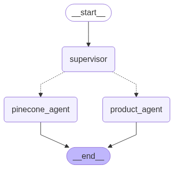

# 🤖 Multi-Agent System with Dynamic Tool Routing

Welcome to the **Multi-Agent** repository! This project leverages the [LangGraph](https://github.com/langchain-ai/langgraph) framework to build a dynamic multi-agent system with professional, production-ready routing between two specialized agents:

- 🔗 **[Custom RAG Agent](https://github.com/YUGESHKARAN/pinecone_ai.git)**
- 🍃 **[MongoDB Product Agent](https://github.com/YUGESHKARAN/ai_product_agent.git)**

---

## 🛠️ Key Features

- **Dynamic Agent Selection:**  
  Intelligently routes user queries to the optimal agent based on context and intent.
- **Seamless Integration:**  
  Combines Retrieval-Augmented Generation (RAG) and product data management in one unified API.
- **LangGraph Powered:**  
  Built on top of the [LangGraph](https://github.com/langchain-ai/langgraph) framework for robust, scalable agent orchestration.
- **Plug & Play Agents:**  
  Easily extend or swap out agent logic as your application grows.

---

## 📁 Folder Structure

```plaintext
.
├── __pycache__/
├── agents/
├── .gitignore
├── app.py
├── image_tools.py
├── image_tools2.py
├── langgraph_app.py
├── mongodb_database.py
├── requirements.txt
└── run.py
```

- **agents/**: Contains agent implementations and logic.
- **app.py**: Main application entry point.
- **langgraph_app.py**: LangGraph-based orchestration and routing logic.
- **mongodb_database.py**: MongoDB interaction utilities.
- **image_tools.py, image_tools2.py**: Image processing tools/utilities.
- **run.py**: Script to start the application.
- **requirements.txt**: Python dependencies.

---

## 🕸️ Multi-Agent Graph

Below is a visual representation of the agent orchestration graph:



> _Supervisor node dynamically routes user queries to either the `pinecone_agent` (for RAG/document tasks) or the `product_agent` (for MongoDB/product tasks), then ends the flow._

---

## 🏗️ Architecture Overview

### 🧭 Tool Router

The heart of this system is a **supervisor router** that determines which agent to invoke using a prompt-based tool selection strategy:

```python
router_prompt = PromptTemplate.from_template("""
You are a tool router. Your job is to pick one tool name only.

Available tools:
- "product_agent": For user data, products, inserting or updating MongoDB entries.
- "pinecone_agent": For questions about documents or needing RAG over uploaded documents.

ONLY return one word: "product_agent" or "pinecone_agent". No explanation.

Question: {question}
Tool:
""")

router_chain = router_prompt | llm_router | StrOutputParser()
```

### 🏪 State Management

The system manages conversation and routing state using a simple `AppState` class:

```python
class AppState(BaseModel):
    question: str
    email: str
    chat_history: Optional[List[BaseMessage]] = []
    answer: Optional[str] = None
    route: Optional[str] = None
```

### 🚦 Router Function

The router function leverages the routing chain to select the appropriate agent:

```python
def router_fn(state: AppState) -> dict:
    tool = router_chain.invoke({"question": state.question})
    return {"route": tool.strip().lower()}
```

---

## 🤝 Agents

- **Pinecone Agent** ([Repo](https://github.com/YUGESHKARAN/pinecone_ai.git))  
  ✨ Handles questions about documents and performs RAG operations over uploaded files.

- **Product Agent** ([Repo](https://github.com/YUGESHKARAN/ai_product_agent.git))  
  🗃️ Manages user data, product information, and MongoDB interactions (insertion, updating, etc.)

---

## 🚀 Getting Started

### 1. Clone the Repository

```bash
git clone https://github.com/YUGESHKARAN/multi_agent.git
cd multi_agent
```

### 2. Install Requirements

```bash
pip install -r requirements.txt
```

### 3. Configure Environment

Create a `.env` file in the root directory with the following variables:

```env
GROQ_API_KEY=
OPENAI_API_KEY=
HUGGINGFACE_API_KEY=
MONGODB_URI=
PINECONE_API_KEY=
BUCKET_NAME=
BUCKET_REGION=
ACCESS_KEY=
SECRET_ACCESS_KEY=
SERPAPI_API_KEY=
UNSPLASH_ACCESS_KEY=
```

**Note:**  
- Obtain these keys/tokens from the respective service dashboards.
- The `.env` file is required for the agents and integrations to function.

### 4. Run the Multi-Agent System

```bash
python langgraph_app.py
```

---

## 📦 Related Projects

- [Custom RAG Agent (pinecone_ai)](https://github.com/YUGESHKARAN/pinecone_ai.git)
- [MongoDB Product Agent (ai_product_agent)](https://github.com/YUGESHKARAN/ai_product_agent.git)

---

## 📝 License

Distributed under the MIT License. See `LICENSE` for more information.

---

## 💡 Contributing

Pull requests are welcome! Feel free to open issues for feature requests or bug reports.

---

## 📫 Contact

For questions, suggestions, or support, reach out via [GitHub Issues](https://github.com/YUGESHKARAN/multi_agent/issues).

---

**Empowering AI with smart, context-aware multi-agent orchestration!** 🚦🤝🤖

---

### 📊 Multi-Agent Graph


<!-- Replace with actual path if committed to the repo, or keep as reference for local/remote documentation -->
